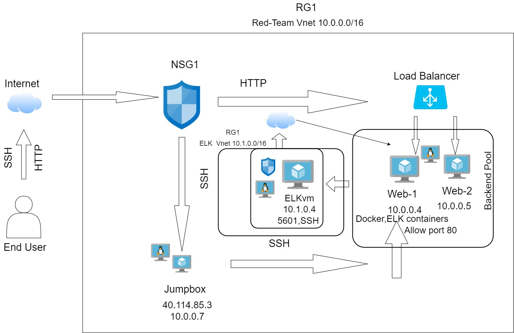

# ELK-Project-
## Automated ELK Stack Deployment

The files in this repository were used to configure the network depicted below.

These files have been tested and used to generate a live ELK deployment on Azure. They can be used to either recreate the entire deployment pictured above. Alternatively, select portions of the _____ file may be used to install only certain pieces of it, such as Filebeat.

This document contains the following details:
- Description of the Topologu
- Access Policies
- ELK Configuration
  - Beats in Use
  - Machines Being Monitored
- How to Use the Ansible Build

### Description of the Topology

The main purpose of this network is to expose a load-balanced and monitored instance of DVWA, the D*mn Vulnerable Web Application.

Load balancing ensures that the application will be highly efficent, in addition to restricting  availability to the network.
In the cloud infrastructure load balancers help protect against DDoS attacks. Benefits of the Jump Box VM is that it is secure and you must connect to it before launching administrative tasks. Also it acts as an audit within the DMZ where we can manage user accounts.

Integrating an ELK server allows users to easily monitor the vulnerable VMs for changes to the data and system logs.
It monitors the log files or locations that you specify, collects logs events and forwards them to Elasticsearch for indexing.
It takes the metrics and statistics that it collects and ships them into an output that you specify in Elasticsearch. Also helps monitor servers with Apache. 

The configuration details of each machine may be found below.
_Note: Use the [Markdown Table Generator](http://www.tablesgenerator.com/markdown_tables) to add/remove values from the table_.

| Name     | Function | IP Address | Operating System |
|----------|----------|------------|------------------|
| Jump Box | Gateway  | 10.0.0.1   | Linux            |
| ELKvm    | SIEM     | 10.1.0.4   | Linux            |
| web-1    | VM       | 10.0.0.4   | Linux            |
| web-2    | VM       | 10.0.0.5   | Linux            |

### Access Policies

The machines on the internal network are not exposed to the public Internet. 

Only the Jump-Box machine can accept connections from the Internet. Access to this machine is only allowed from the following IP addresses:
whitelisted IP addresses_76.86.220.247

Machines within the network can only be accessed by Jump-Box.
Jump-Box 20.124.242.7

A summary of the access policies in place can be found in the table below.

| Name     | Publicly Accessible | Allowed IP Addresses |
|----------|---------------------|----------------------|
| Jump Box | Yes/No              | 10.0.0.1 10.0.0.2    |
|          |                     |                      |
|          |                     |                      |

### Elk Configuration

Ansible was used to automate configuration of the ELK machine. No configuration was performed manually, which is advantageous because...

The playbook implements the following tasks:
Create Elk VM and NSG
Peer connect ELK with your RG 
Download Docker
Create a container
Create YAML file and Playbook
- ...

The following screenshot displays the result of running `docker ps` after successfully configuring the ELK instance.

### Target Machines & Beats
This ELK server is configured to monitor the following machines:
Web-1 20.120.92.67 , 10.0.0.4  & web-2  20.120.92.67  , 10.0.0.5

We have installed the following Beats on these machines:

curl -L -O https://artifacts.elastic.co/downloads/beats/filebeat/filebeat-7.4.0-amd64.deb

These Beats allow us to collect the following information from each machine:
**Metric beat takes metrics and statistics that it collects and uploads them into  Elasticsearch. File beat  monitors the log files, collects logs events and forwards them to Elasticsearch for indexing. In Kibana you will see visual representations of all sorts of data and monitor SIEM.

### Using the Playbook
In order to use the playbook, you will need to have an Ansible control node already configured. Assuming you have such a control node provisioned: 

SSH into the control node and follow the steps below:
- Copy the ansible configuration file to ansible.cfg.
- Update the ansible.cfg file to include... Remote user = azureuser
- Run the playbook, and navigate to http://20.109.152.33:5601/app/kibana#/home___ to check that the installation worked as expected.

/etc/ansible directory cp to playbook.yml

- _Which file do you update to make Ansible run the playbook on a specific machine? How do I specify which machine to install the ELK server on versus which to install Filebeat on?_ We updated the playbook.yml to download onto our docker container. From our Jump-Box we start and then attach to our container. Then we run the play book from there, where file beat and metric beat reside. We also run our install-elk.yml playbook in this location**.

- _Which URL do you navigate to in order to check that the ELK server is running? http://20.109.152.33:5601/app/kibana#/home_

-ansible-playbook install-elk.yml

 -curl -L -O https://artifacts.elastic.co/downloads/beats/filebeat/filebeat-7.6.1-amd64.deb
